# Curso de Álgebra Lineal Aplicada para Machine Learning

- [Curso de Álgebra Lineal Aplicada para Machine Learning](#curso-de-álgebra-lineal-aplicada-para-machine-learning)
  - [Modulo 1 Transformaciones lineales y descomposición de matrices](#modulo-1-transformaciones-lineales-y-descomposición-de-matrices)
    - [Clase 1 Introduccion al curso](#clase-1-introduccion-al-curso)
    - [Clase 2 Podemos y debemos pensar a las matrices como transformaciones lineales](#clase-2-podemos-y-debemos-pensar-a-las-matrices-como-transformaciones-lineales)
    - [Clase 3 Autovalores y Autovectores](#clase-3-autovalores-y-autovectores)
    - [Clase 4 Como calcular los autovalores y autovectores](#clase-4-como-calcular-los-autovalores-y-autovectores)
    - [Clase 5 Descomposición de matrices](#clase-5-descomposición-de-matrices)
    - [Clase 6 Como descompongo una matriz no cuadrada (SVD)](#clase-6-como-descompongo-una-matriz-no-cuadrada-svd)
    - [Clase 7 Las tres transformaciones](#clase-7-las-tres-transformaciones)
    - [Clase 8 Aplicacion de las matrices D y V y U y su efecto en la transformacion](#clase-8-aplicacion-de-las-matrices-d-y-v-y-u-y-su-efecto-en-la-transformacion)
    - [Clase 9 Como interpretar los valores singulares](#clase-9-como-interpretar-los-valores-singulares)
  - [Modulo 2  Aplicaciones de SVD a una imagen](#modulo-2-aplicaciones-de-svd-a-una-imagen)
    - [Clase 10 Una imagen es una matriz](#clase-10-una-imagen-es-una-matriz)
    - [Clase 11 Apliquemos la descomposicion SVD a una imagen](#clase-11-apliquemos-la-descomposicion-svd-a-una-imagen)
    - [Clase 12 Buscando la cantidad de valores singulares que nos sirvan](#clase-12-buscando-la-cantidad-de-valores-singulares-que-nos-sirvan)
    - [Clase 13 Que es una pseudo inversa de Moore Penrose y como calcularla](#clase-13-que-es-una-pseudo-inversa-de-moore-penrose-y-como-calcularla)
    - [Clase 14 Usando la pseudo inversa para resolver un sistema sobredeterminado](#clase-14-usando-la-pseudo-inversa-para-resolver-un-sistema-sobredeterminado)
  - [Modulo 3 Aplicando Álgebra Lineal: Análisis de Componentes Principales (PCA)](#modulo-3-aplicando-álgebra-lineal-análisis-de-componentes-principales-pca)
    - [Clase 15 Que es PCA](#clase-15-que-es-pca)
    - [Clase 16 Preparando el conjunto de imagenes para aplicar PCA](#clase-16-preparando-el-conjunto-de-imagenes-para-aplicar-pca)
    - [Clase 17 Apliquemos PCA a un conjunto de imagenes](#clase-17-apliquemos-pca-a-un-conjunto-de-imagenes)
    - [Clase 18 Cierre del curso](#clase-18-cierre-del-curso)

## Modulo 1 Transformaciones lineales y descomposición de matrices

### Clase 1 Introduccion al curso

Introducción por el profesor, en ML y DL debemos tener cuidado con los tiempos computaciones, si nosotros no somos cuidadosos y reducimos la cantidades dimensiones que estamos entregando vamos a necesitar grandes volúmenes de datos que hagan que nuestros procesos tal vez demoren mucho mas tiempo.

Recuerda que las matrices las pensamos como transformaciones lineales.

### Clase 2 Podemos y debemos pensar a las matrices como transformaciones lineales

Las matrices las podemos pensar como transformaciones lineales, que cuando las aplicamos a un espacio o a un vector generan una transformación, la transformación en el caso de un vector significa que lo acorta, lo achica o incluso generamos una rotación.

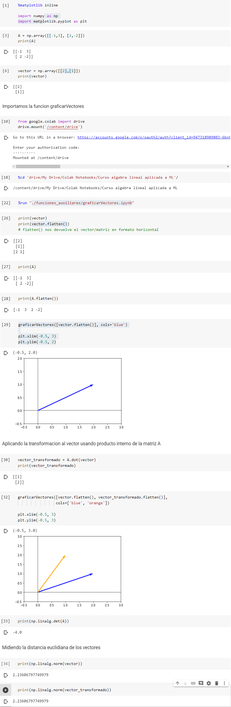

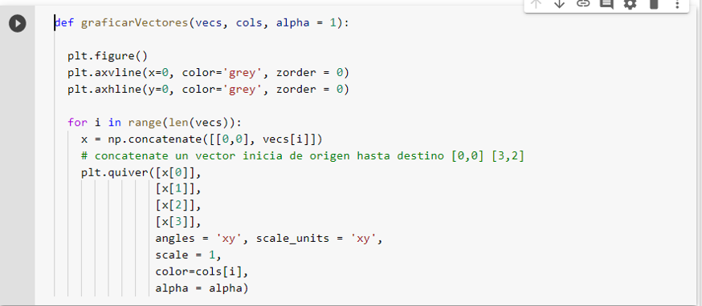

### Clase 3 Autovalores y Autovectores

Las transformaciones lineales ejercen transformaciones sobre nuestros vectores,  busquemos si podemos encontrar un vector que al aplicarle una transformación no sufre ninguna modificacion en su dirección, estos son los **Autovectores**, aunque puede tener una amplitud distinta y también puede estar multiplicado por el autoValor.

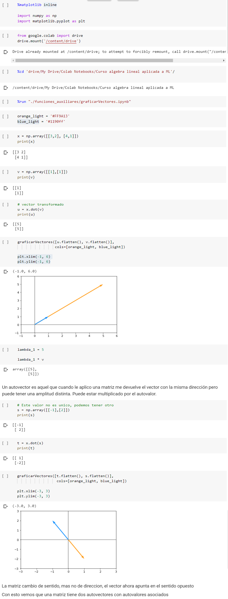

Una matriz tiene dos autovectores con autovalores asociados

### Clase 4 Como calcular los autovalores y autovectores

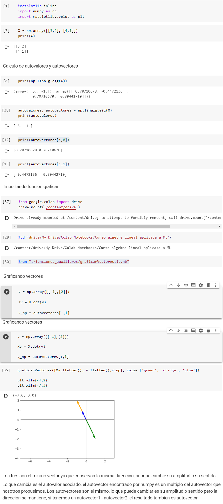

De la ultima gráfica podemos inferir que los tres son el mismo vector ya que conservan la misma dirección, aunque cambie su amplitud o su sentido.

Lo que cambia es el autovalor asociado, el autovector encontrado por numpy es un múltiplo del autovector que nosotros propusimos. Los autovectores son el mismo, lo que puede cambiar es su amplitud o sentido pero la dirección se mantiene, si tenemos un autovector1 - autovector2, el resultado tambien es autovector

### Clase 5 Descomposición de matrices

Descomponer una matriz quiere decir encontrar dos o mas matrices que me puedan ayudar a escribir mi matriz original y que tengan ciertas propiedades (como 6 que es igual a 3*2)

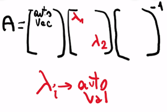

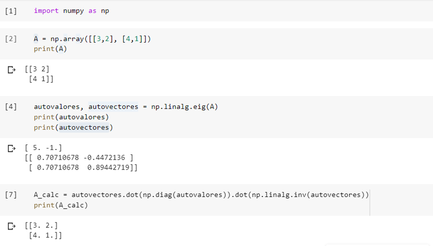

Tenemos otras descomposiciones en el caso de que una matriz sea real (sin números complejos) y simétrica (A == A.transpuesta)

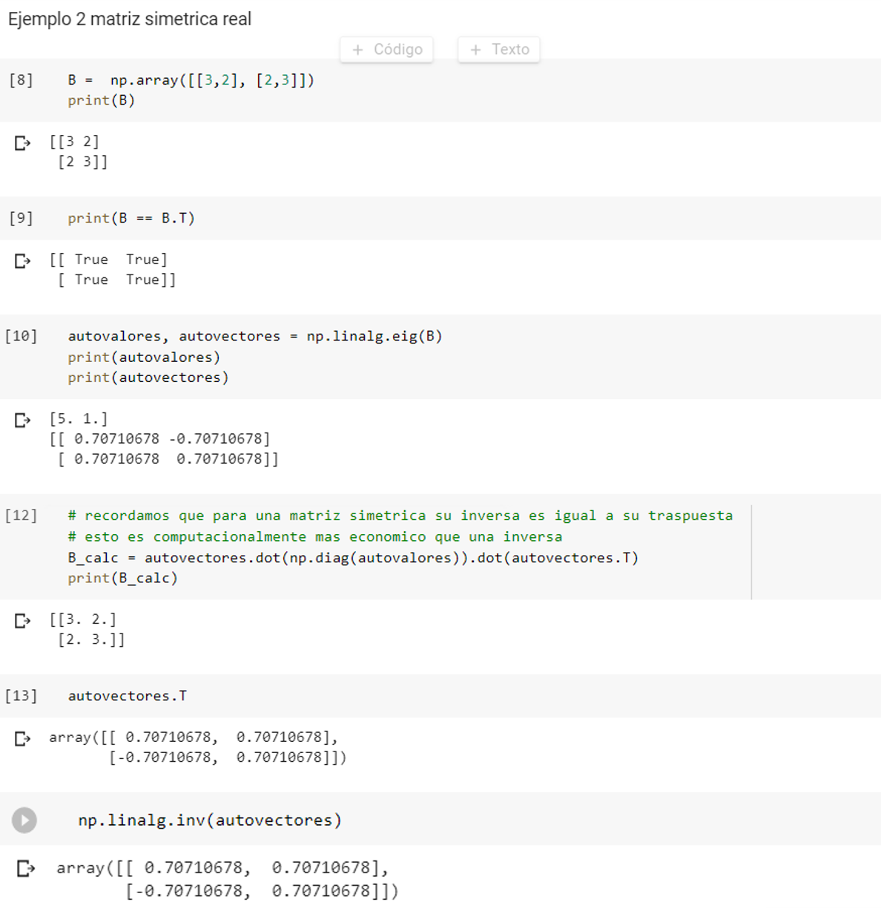

### Clase 6 Como descompongo una matriz no cuadrada (SVD)

La descomposicion de matrices en autovalores y autovectores solo se puede realizar en matrices cuadradas, cuando la matriz no e cuadrada se necesita realizar la **descomposicion en valores singulares**

Realizaremos la descomposicion de la matriz en 3

Matriz U: Vectores Izquierdos singulares

Matriz V: Vectores derechos singulares

Matriz D: Matriz Diagonal con los valores singulares que calculamos, y ceros fuera de la diagonal

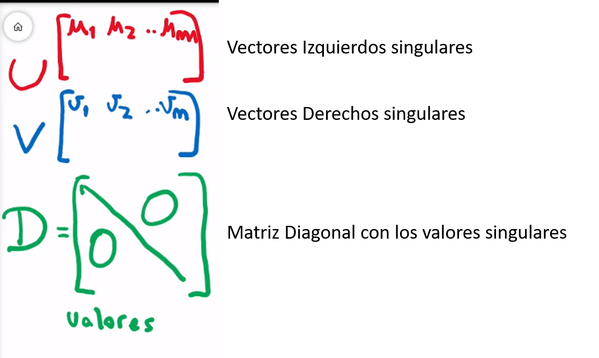

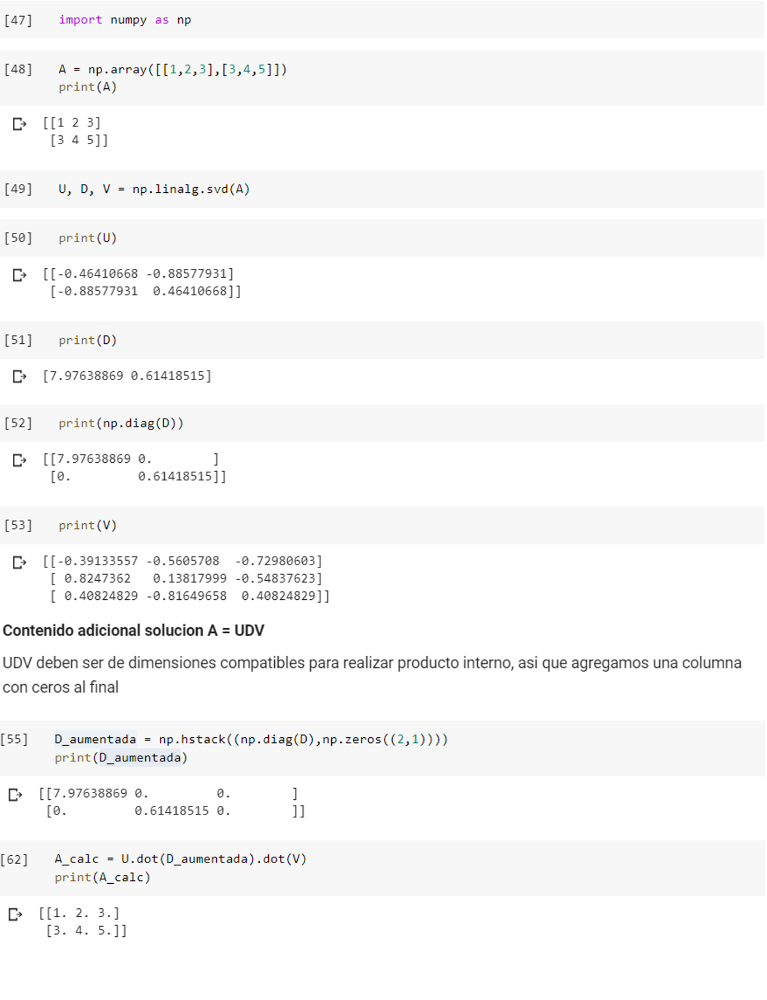

Los vectores y matrices pueden ser pensados como sub-transformaciones del espacio, si tuviéramos una matriz de 3x2, lo que estamos haciendo al transformar el espacio es tomar un espacio de R3 y convertirlo en R2, es decir estamos condensando información del tercer eje dentro de los únicos dos ejes que vamos a conservar.

### Clase 7 Las tres transformaciones

Cuando pensamos en matrices pensamos en ellas como transformaciones lineales, entonces si tenemos una matriz A y la podemos descomponer en tres matrices esto quiere decir que a cada una de estas tres matrices las podemos pensar tambien como sus propias transformaciones lineales.

Veremos estas tres con el ejemplo del circulo unitario, pero lo cierto es que estas transformaciones se aplican independientemente de los vectores a los que se los estemos aplicando

Creamos la funcion graficarMatriz

Implementamos el ejemplo

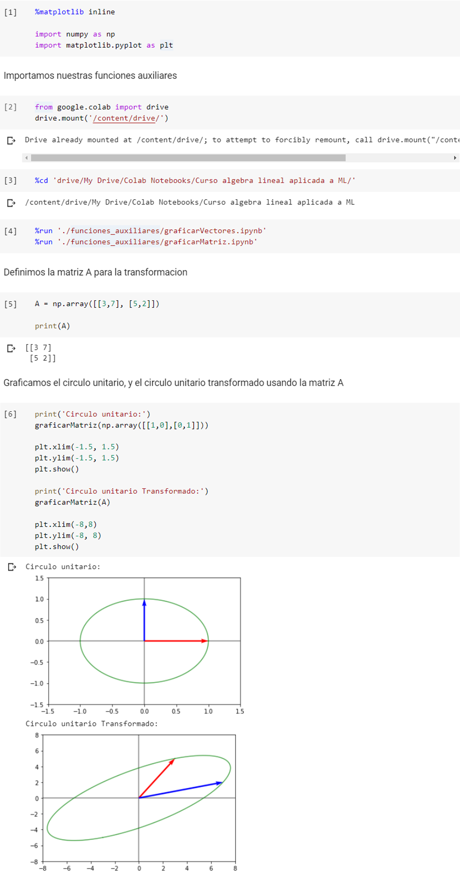

### Clase 8 Aplicacion de las matrices D y V y U y su efecto en la transformacion

La descomposicion UDV nos devuelve tres matrices de nuestra matriz original.

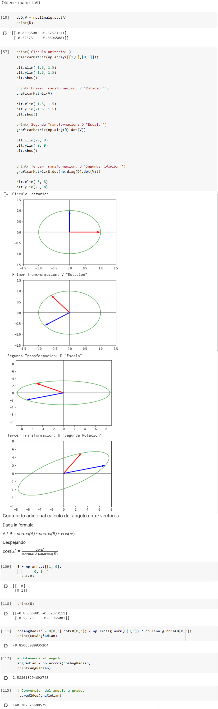

### Clase 9 Como interpretar los valores singulares

En la descomposicion UDV (SDV en ingles) vimos que obtenemos 3 matrices, donde D es una matriz diagonal compuesta por los valores singulares.

Veamos el efecto que tienen estos valores singulares en la transformacion Total.

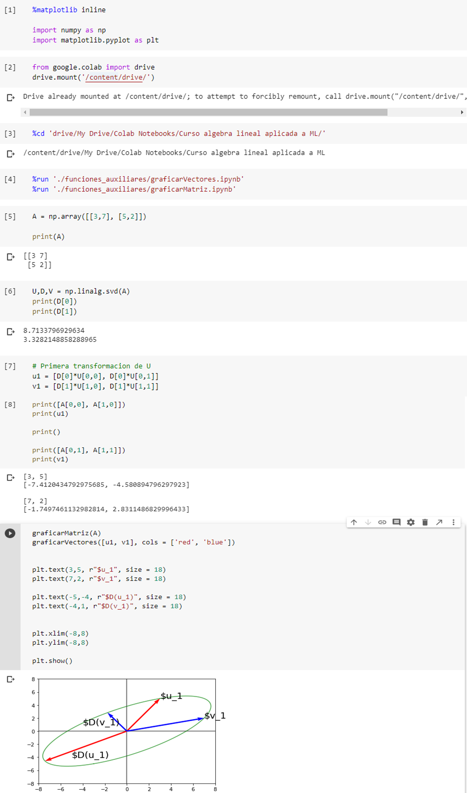

## Modulo 2  Aplicaciones de SVD a una imagen

### Clase 10 Una imagen es una matriz

La aplicacion de SVD a una imagen tiene implicancias  directas la compresion que podemos realizar al momento de tener que transmitirlas o como podemos hacer para ocupar menos espacio.

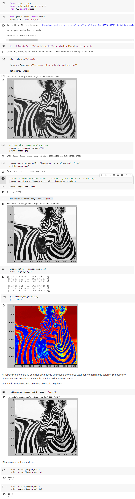

Uso y Hint: En ML por optimizacion y para evitar que nuestros algoritmos no tengan problemas de convergencia nos conviene reducir los valores de las matrices en las imagenes a valores entre 0  y 1 dividiendo todos los números por el máximo posible. 

**Notas adicionales a la clase**.

De la documentación de Pillow método **Image.getdata()**

PIL is the Python Imaging Library which provides the python interpreter with image editing capabilities. The Image module provides a class with the same name which is used to represent a PIL image. The module also provides a number of factory functions, including functions to load images from files, and to create new images.

**getdata()** Returns the contents of this image as a sequence object containing pixel values. The sequence object is flattened, so that values for line one follow directly after the values of line zero, and so on.

Note that the sequence object returned by this method is an internal PIL data type, which only supports certain sequence operations. To convert it to an ordinary sequence (e.g. for printing), use list(im.getdata()).

Syntax: Image.getdata(band=None)

Parameters:

band – What band to return. The default is to return all bands. To return a single band, pass in the index value (e.g. 0 to get the “R” band from an “RGB” image).

Returns type: A sequence-like object.

### Clase 11 Apliquemos la descomposicion SVD a una imagen

Apliquemos SDV a una imagen y veamos los efectos sobre la misma, ya que si queremos disminuir disminuir el tamaño de nuestro archivo por ejemplo, tendríamos que definir cuando esta imagen va a continuar siendo reconocible.

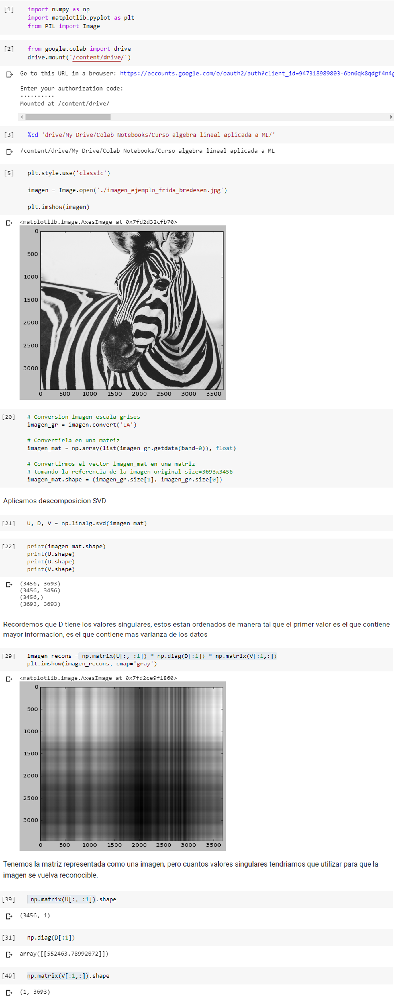

### Clase 12 Buscando la cantidad de valores singulares que nos sirvan

La compresion de imagenes por medio de la descomposicion de SDV hace uso de que muy pocos de los valores singulares realmente están representando información, la mayoría de ellos apenas logran capturar un porcentaje muy pequeño de su varianza.

Veamos cuantos necesitaríamos para empezar a reconocer nuestra imagen.

### Clase 13 Que es una pseudo inversa de Moore Penrose y como calcularla

La pseudo inversa de Moore Penrose es una aplicacion directa de SDV que nos permite resolver en determinados momentos sistemas de ecuaciones lineales.

Un sistema de ecuaciones lineales lo podemos  representar como:

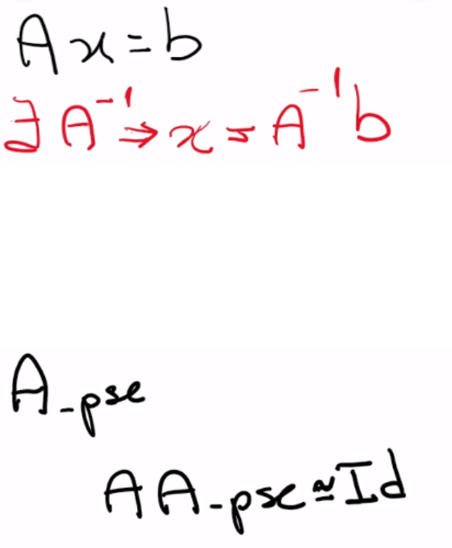

Pero que ocurre cuando no existe este A^-1, cuando no existe la inversa.

Entonces podemos llamar a una matriz A_pse

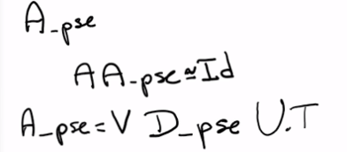

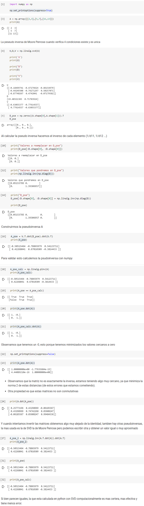

### Clase 14 Usando la pseudo inversa para resolver un sistema sobredeterminado

Un sistema de ecuaciones A *  X = B puede tener 0 soluciones, 1 solución o infinitas soluciones. En el caso en el que tenga una solucion es que tenemos inversa, estamos trabajando con una matriz cuadrada y todos sus vectores son linealmente independientes tanto por filas como por columnas.

Ahora veremos como aplicarlo para por medio de la pseudo inversa encontrar una solucion X tal que tenga la siguiente propiedad.

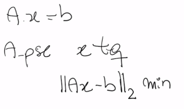

Partiendo de un sistema A por x igual a B, encontraremos una A_pse con una x tal que la norma cuadrada de Ax - b sea minima.

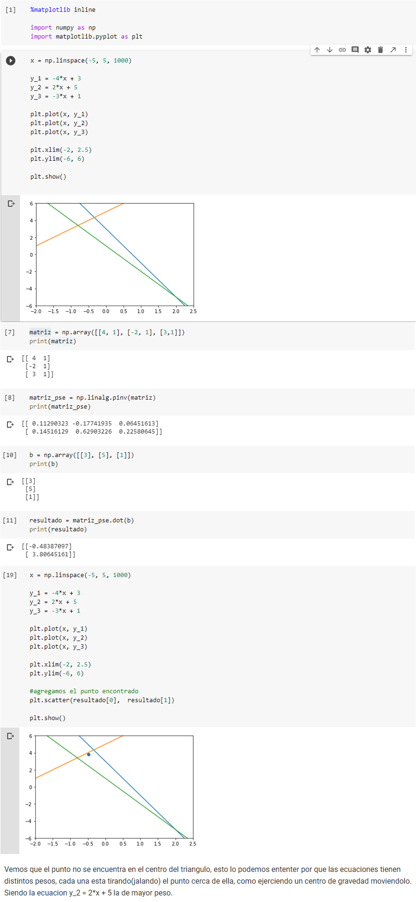

## Modulo 3 Aplicando Álgebra Lineal: Análisis de Componentes Principales (PCA)

### Clase 15 Que es PCA

Cuando estamos trabajando con análisis de datos tenemos que enriquecer nuestro problema con información de contexto, es de esta manera que combinando variables y agregando información externa terminamos  haciendo crecer nuestro mundo de manera exponencial.

En estadística tenemos un problema llamado  **la maldición de la dimension**. Esto dice que por cada variable que agrego en mi conjunto de datos vamos a necesitar exponencialmente mas muestras para poder tener la misma relevancia estadística.

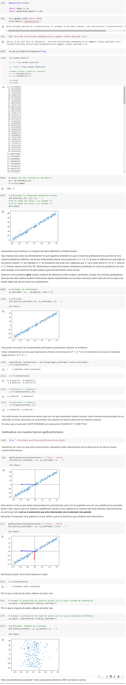

**recursos adicionales a la clase**.

<https://www.cienciadedatos.net/documentos/35_principal_component_analysis>

<https://www.youtube.com/watch?v=FgakZw6K1QQ>

<https://www.jacobsoft.com.mx/es_mx/analisis-del-componente-principal/>

<https://www.cienciadedatos.net/documentos/35_principal_component_analysis>

### Clase 16 Preparando el conjunto de imagenes para aplicar PCA

Análisis de complementos principales (PCA) es una técnica muy util para reducir la cantidad de dimensiones con las que estamos trabajando, muchas veces tenemos un conjunto de dimensiones mu grandes y lo que necesitamos es reducirlo para quedarnos por ejemplo con el 80% de  la información que contiene nuestro conjunto de datos, pero que variables son las que debemos conservar?

Veamos un ejemplo aplicado a imagenes

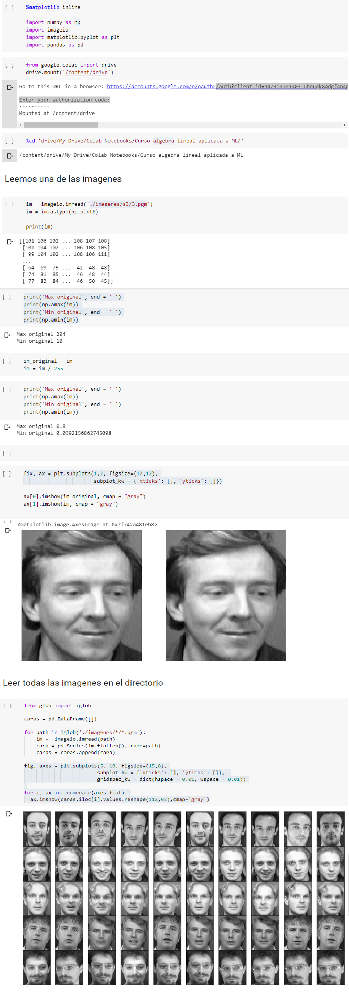

### Clase 17 Apliquemos PCA a un conjunto de imagenes

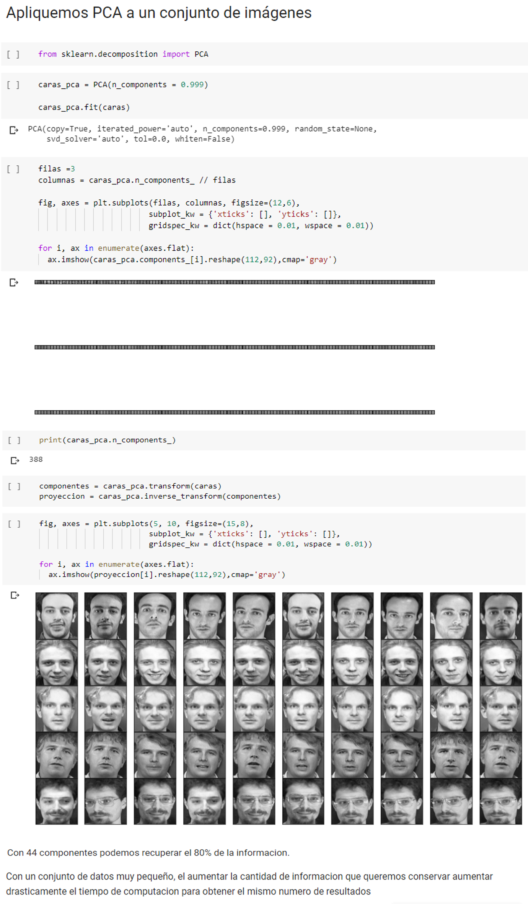

### Clase 18 Cierre del curso

Nunca Pares de Aprender!
